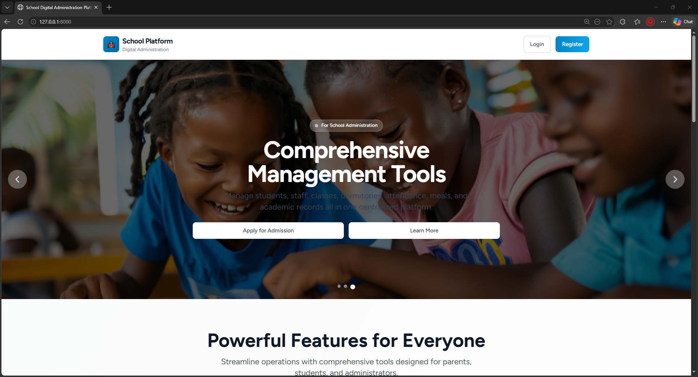
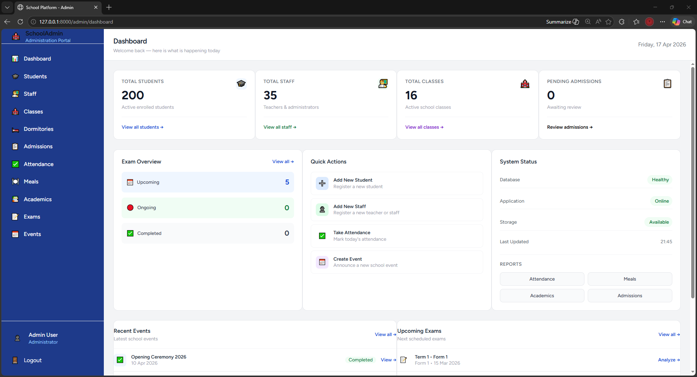
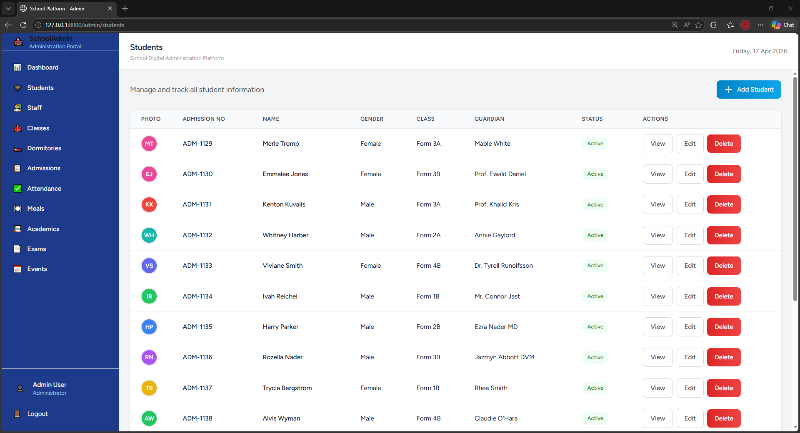
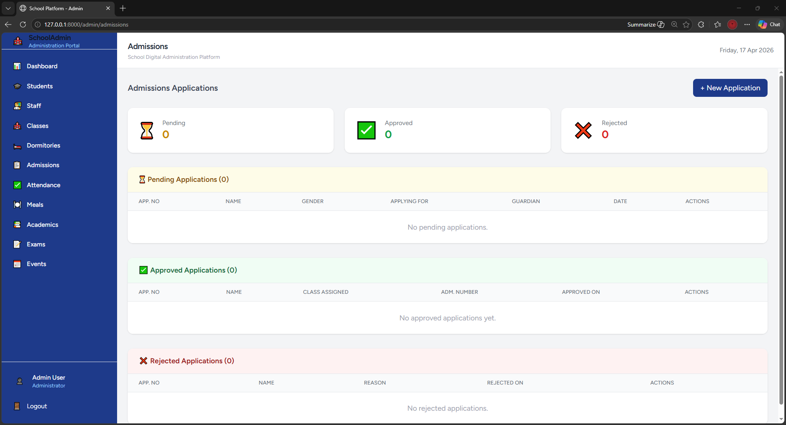
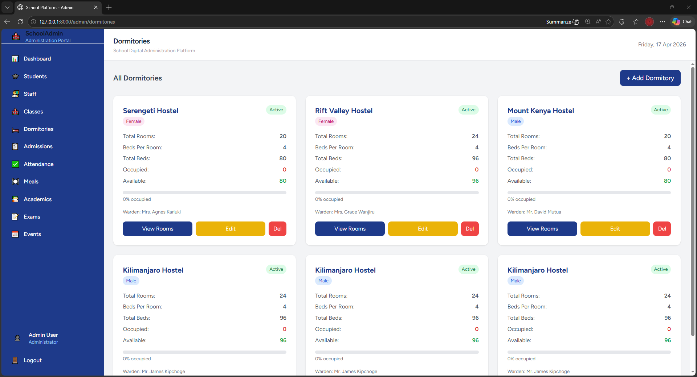
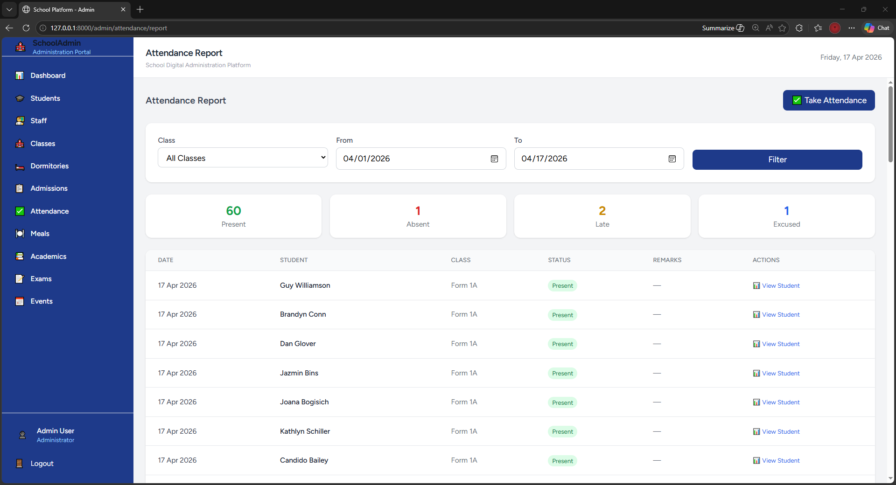

# 🏫 School Digital Administration and Analytics Platform

> A cloud-based school management system built with Laravel 9, designed specifically for Kenyan secondary schools and private learning institutions. It digitizes and centralizes core administrative operations including admissions, dormitory management, attendance tracking, academic performance, and more.

---

## 📋 Table of Contents

1. [Project Overview](#-project-overview)
2. [Features](#-features)
3. [Tech Stack](#-tech-stack)
4. [System Requirements](#-system-requirements)
5. [Installation Guide](#-installation-guide)
6. [Project Structure](#-project-structure)
7. [User Roles](#-user-roles)
8. [Module Breakdown](#-module-breakdown)
9. [Database Schema](#-database-schema)
10. [How Laravel Works in This Project](#-how-laravel-works-in-this-project)
11. [Running the Application](#-running-the-application)
12. [Default Login Credentials](#-default-login-credentials)
13. [Common Errors & Fixes](#-common-errors--fixes)
14. [Contributing](#-contributing)

---

## 📌 Project Overview

Many secondary schools and private learning institutions in Kenya still rely heavily on manual and semi-digital processes to manage core operations. Paper files, registers, and disconnected spreadsheets lead to:

- Long admission queues and data loss
- Delayed reporting and lack of transparency
- Increased administrative workload
- No real-time visibility for parents

This platform solves these problems by providing a **single integrated system** that handles everything from admissions to dormitory bed allocation — all accessible from a browser.

---

## ✨ Features

| Module | Description |
|--------|-------------|
| 🔐 **Authentication & Roles** | Login/Register with role-based access (Admin, Teacher, Parent, Student) |
| 📋 **Admissions** | Parents and students apply online; admin reviews, approves, or rejects |
| 🎓 **Student Management** | Full CRUD for student records with auto-generated admission numbers |
| 👨‍🏫 **Staff Management** | Manage teaching and non-teaching staff with full profiles |
| 🏫 **Class Management** | Create classes, assign teachers, track capacity and student counts |
| 🛏️ **Dormitory Management** | Auto-generate rooms and beds; gender-based allocation; track occupancy |
| ✅ **Attendance Tracking** | Mark attendance per class per day with present/absent/late/excused status |
| 🍽️ **Meal Tracking** | Track student meal check-ins per session |
| 📚 **Academic Performance** | Record and view student marks and grades per subject and term |
| 📅 **Events & Timetable** | Plan and publish school events and class timetables |
| 👨‍👩‍👦 **Parent Portal** | Parents view child's progress, attendance, and application status |
| 📊 **Analytics Dashboard** | Admin dashboard with stats on students, staff, classes, and admissions |

---
## 📸 Screenshots

### 🔐 Login & Authentication


### 📊 Admin Dashboard


### 🎓 Student Management


### 📋 Admissions Review Panel


### 🛏️ Dormitory Management


### ✅ Attendance Tracking


---

## 🛠 Tech Stack

| Layer | Technology |
|-------|-----------|
| **Backend Framework** | Laravel 9 (PHP) |
| **Frontend** | Blade Templates + Tailwind CSS + Alpine.js |
| **Authentication** | Laravel Breeze |
| **Roles & Permissions** | Spatie Laravel Permission |
| **Database** | MySQL |
| **Package Manager (PHP)** | Composer |
| **Package Manager (JS)** | NPM |
| **Local Server** | XAMPP (Apache + MySQL) |

---

## 💻 System Requirements

Before you begin, make sure your machine has the following installed:

| Tool | Minimum Version | How to Check |
|------|----------------|--------------|
| PHP | 8.0+ | `php -v` |
| Composer | 2.0+ | `composer -v` |
| Node.js | 16+ | `node -v` |
| NPM | 8+ | `npm -v` |
| MySQL | 5.7+ | Via XAMPP or standalone |

> **Recommended:** Install [XAMPP](https://www.apachefriends.org) on Windows — it gives you PHP and MySQL in one package.

---

## 🚀 Installation Guide

Follow these steps **exactly in order** to get the project running on your machine.

### Step 1 — Clone or Download the Project

If using Git:
```bash
git clone https://github.com/your-username/school-platform.git
cd school-platform
```

Or download the ZIP and extract it to `C:\xampp\htdocs\school-platform`

---

### Step 2 — Install PHP Dependencies

```bash
composer install --prefer-dist
```

> This downloads all the Laravel packages the project needs. It may take a few minutes depending on your internet connection.

---

### Step 3 — Install JavaScript Dependencies

```bash
npm install
```

---

### Step 4 — Set Up Environment File

Copy the example environment file:

```bash
cp .env.example .env
```

On Windows Command Prompt:
```bash
copy .env.example .env
```

Then open `.env` in a text editor and update the database settings:

```env
APP_NAME="School Platform"
APP_URL=http://127.0.0.1:8000

DB_CONNECTION=mysql
DB_HOST=127.0.0.1
DB_PORT=3306
DB_DATABASE=school_platform
DB_USERNAME=root
DB_PASSWORD=
```

> Leave `DB_PASSWORD` blank if you are using XAMPP's default MySQL (no password set).

---

### Step 5 — Generate Application Key

```bash
php artisan key:generate
```

---

### Step 6 — Create the Database

1. Open your browser and go to: `http://localhost/phpmyadmin`
2. Click **"New"** on the left sidebar
3. Type database name: `school_platform`
4. Click **Create**

---

### Step 7 — Run Migrations

This creates all the database tables:

```bash
php artisan migrate
```

You should see output like:
```
Migrating: 2014_10_12_000000_create_users_table ✓
Migrating: create_roles_and_permissions_tables ✓
Migrating: create_students_table ✓
...
```

---

### Step 8 — Seed the Database (Create Admin + Roles)

```bash
php artisan db:seed --class=RolesAndAdminSeeder
```

This creates:
- The 4 system roles: `admin`, `teacher`, `parent`, `student`
- A default admin account (see credentials below)

---

### Step 9 — Publish Spatie Permission Files (if not done)

```bash
php artisan vendor:publish --provider="Spatie\Permission\PermissionServiceProvider"
php artisan migrate
```

---

### Step 10 — Start the Development Server

Open **two terminal windows** both inside the project folder:

**Terminal 1 — Compile CSS/JS:**
```bash
npm run dev
```

**Terminal 2 — Start Laravel server:**
```bash
php artisan serve
```

Now open your browser and visit:
```
http://127.0.0.1:8000
```

You should see the School Platform landing page! 🎉

---

## 📁 Project Structure

Here is a breakdown of the most important folders and files:

```
school-platform/
│
├── app/
│   ├── Http/
│   │   ├── Controllers/
│   │   │   ├── Admin/              ← All admin module controllers
│   │   │   │   ├── StudentController.php
│   │   │   │   ├── StaffController.php
│   │   │   │   ├── ClassController.php
│   │   │   │   ├── DormitoryController.php
│   │   │   │   ├── AdmissionController.php
│   │   │   │   ├── AttendanceController.php
│   │   │   │   ├── MealController.php
│   │   │   │   ├── AcademicController.php
│   │   │   │   └── EventController.php
│   │   │   ├── Parent/
│   │   │   │   └── ParentAdmissionController.php
│   │   │   ├── Student/
│   │   │   │   └── StudentAdmissionController.php
│   │   │   └── DashboardController.php
│   │   └── Kernel.php              ← Middleware registration
│   │
│   └── Models/                     ← Database models (one per table)
│       ├── User.php
│       ├── Student.php
│       ├── Staff.php
│       ├── SchoolClass.php
│       ├── Dormitory.php
│       ├── DormitoryRoom.php
│       ├── DormitoryBed.php
│       ├── Admission.php
│       └── Attendance.php
│
├── database/
│   ├── migrations/                 ← Table blueprints (run with artisan migrate)
│   └── seeders/
│       └── RolesAndAdminSeeder.php ← Creates default roles and admin user
│
├── resources/
│   └── views/                      ← All HTML pages (Blade templates)
│       ├── layouts/
│       │   ├── admin.blade.php     ← Admin sidebar layout
│       │   └── portal.blade.php    ← Parent/student portal layout
│       ├── admin/
│       │   ├── students/           ← Student CRUD pages
│       │   ├── staff/              ← Staff CRUD pages
│       │   ├── classes/            ← Class CRUD pages
│       │   ├── dormitories/        ← Dormitory management pages
│       │   ├── admissions/         ← Admin admission review pages
│       │   └── attendance/         ← Attendance taking and reports
│       ├── parent/
│       │   └── admissions/         ← Parent application pages
│       ├── student/
│       │   └── admissions/         ← Student application pages
│       ├── dashboards/
│       │   ├── admin.blade.php
│       │   ├── teacher.blade.php
│       │   ├── parent.blade.php
│       │   └── student.blade.php
│       └── auth/                   ← Login and register pages
│
└── routes/
    └── web.php                     ← All URL routes defined here
```

---

## 👥 User Roles

The system has **4 roles**, each with different access levels:

### 👨‍💼 Admin
- Full access to all modules
- Reviews and approves/rejects admission applications
- Manages students, staff, classes, dormitories
- Takes attendance and views reports
- Accesses the analytics dashboard

### 👨‍🏫 Teacher
- Views their assigned class
- Takes attendance for their class
- Views student academic records

### 👨‍👩‍👦 Parent
- Registers and logs in
- Submits admission applications for their child
- Tracks application status (pending / approved / rejected)
- Views child's academic progress and attendance

### 🎓 Student
- Registers and logs in
- Submits their own admission application
- Tracks application status
- Views their own results and timetable after enrollment

---

## 📦 Module Breakdown

### 🔐 Authentication & Roles
- Powered by **Laravel Breeze** for login/register
- **Spatie Laravel Permission** handles roles
- After login, users are automatically redirected to their role-specific dashboard
- Registration requires selecting either `Parent` or `Student` role

### 📋 Admissions Flow
```
Parent/Student registers → Logs in → Submits application form
        ↓
Admin sees application in Admissions panel
        ↓
Admin clicks "Review" → Assigns class and dormitory → Approves
        ↓
Student record auto-created with generated admission number
        ↓
Parent/Student sees "Approved" status with admission details
```

### 🛏️ Dormitory System
- Admin creates a dormitory and sets number of beds per room
- System **automatically generates** 24 rooms with all beds inside each room
- Beds are labelled as Top or Bottom (double decker logic)
- When a student is assigned a dormitory, the system **auto-assigns the next available bed**
- Occupied beds cannot be reassigned
- When a student leaves, their bed is released and becomes available again
- Each dormitory card shows a live capacity progress bar

### ✅ Attendance System
- Admin/Teacher selects a class and a date
- All active students in that class are loaded automatically
- Each student is marked: **Present / Absent / Late / Excused**
- "Mark All Present" button for quick entry
- Live summary shows counts before saving
- Attendance report can be filtered by class and date range
- Individual student attendance history is viewable

---

## 🗄️ Database Schema

Here is a summary of all database tables and what they store:

| Table | Purpose |
|-------|---------|
| `users` | All system users (admin, teacher, parent, student) |
| `roles` | Spatie roles (admin, teacher, parent, student) |
| `model_has_roles` | Links users to their roles |
| `students` | All enrolled student records |
| `staff` | Teaching and non-teaching staff |
| `school_classes` | Class names, levels, teachers, capacity |
| `dormitories` | Dormitory names, gender, warden info |
| `dormitory_rooms` | 24 rooms per dormitory |
| `dormitory_beds` | Individual beds per room with occupancy status |
| `admissions` | Admission applications with status |
| `attendances` | Daily attendance records per student |

---

## 🧠 How Laravel Works in This Project

If you are new to Laravel, here is how everything connects:

```
Browser Request
      ↓
routes/web.php          ← Decides which controller handles the URL
      ↓
Controller (app/Http/Controllers/)  ← Contains the logic
      ↓
Model (app/Models/)     ← Talks to the database
      ↓
View (resources/views/) ← Renders the HTML shown to the user
```

### Example: How the Students List Page Works

1. User visits `/admin/students`
2. `routes/web.php` matches this to `StudentController@index`
3. `StudentController::index()` runs: fetches all students from the database
4. Returns `view('admin.students.index', compact('students'))`
5. `resources/views/admin/students/index.blade.php` loops through students and renders the table

### Key Artisan Commands Used in This Project

```bash
# Create a new controller
php artisan make:controller Admin/StudentController --resource

# Create a model + migration at the same time
php artisan make:model Student -m

# Run all pending migrations
php artisan migrate

# Rollback the last migration
php artisan migrate:rollback

# Run a specific seeder
php artisan db:seed --class=RolesAndAdminSeeder

# Clear application cache
php artisan cache:clear
php artisan config:clear

# Start the development server
php artisan serve
```

---

## ▶️ Running the Application

Every time you want to work on the project, do this:

1. **Start XAMPP** — Make sure Apache and MySQL are running (green)

2. **Open two terminals** in the project folder

3. **Terminal 1:**
```bash
npm run dev
```

4. **Terminal 2:**
```bash
php artisan serve
```

5. **Open browser:**
```
http://127.0.0.1:8000
```

---

## 🔑 Default Login Credentials

After running the seeder, use these to log in as admin:

| Field | Value |
|-------|-------|
| Email | `admin@school.com` |
| Password | `admin1234` |

> **Important:** Change this password immediately after first login in a production environment.

---

## 🐛 Common Errors & Fixes

### ❌ `Target class [role] does not exist`
**Cause:** Spatie middleware not registered  
**Fix:** Open `app/Http/Kernel.php` and add to `$routeMiddleware`:
```php
'role' => \Spatie\Permission\Middleware\RoleMiddleware::class,
'permission' => \Spatie\Permission\Middleware\PermissionMiddleware::class,
```

---

### ❌ `SQLSTATE: Connection refused`
**Cause:** MySQL is not running  
**Fix:** Open XAMPP Control Panel and start MySQL

---

### ❌ `composer create-project` times out
**Cause:** Slow internet connection  
**Fix:** Increase timeout and use `--prefer-dist`:
```bash
composer config --global process-timeout 2000
composer create-project laravel/laravel school-platform "9.*" --prefer-dist
```

---

### ❌ `Route [profile.edit] not defined`
**Cause:** Profile routes missing from `web.php`  
**Fix:** Add these inside the `auth` middleware group in `routes/web.php`:
```php
Route::get('/profile', [ProfileController::class, 'edit'])->name('profile.edit');
Route::patch('/profile', [ProfileController::class, 'update'])->name('profile.update');
Route::delete('/profile', [ProfileController::class, 'destroy'])->name('profile.destroy');
```

---

### ❌ `php` or `mysql` not recognized in terminal
**Cause:** PHP/MySQL not added to system PATH  
**Fix (Windows):**
1. Search for "Environment Variables" in Windows
2. Edit the `Path` system variable
3. Add `C:\xampp\php` and `C:\xampp\mysql\bin`
4. Restart your terminal

---

### ❌ Styles not loading (Tailwind CSS not working)
**Cause:** Frontend not compiled  
**Fix:** Make sure `npm run dev` is running in a terminal

---

## 🤝 Contributing

This project was built as part of an entrepreneurship assignment at **The Technical University of Kenya** by:

**Margaret Wambui Nduta** — BTECHIT SCCJ/01497/2022

If you would like to contribute or extend the project:

1. Fork the repository
2. Create a new branch: `git checkout -b feature/your-feature-name`
3. Make your changes and commit: `git commit -m "Add your feature"`
4. Push to your branch: `git push origin feature/your-feature-name`
5. Open a Pull Request

---

## 📄 License

This project is open source and available under the [MIT License](LICENSE).

---

> Built with ❤️ for Kenyan Schools — **SchoolAdmin Kenya**